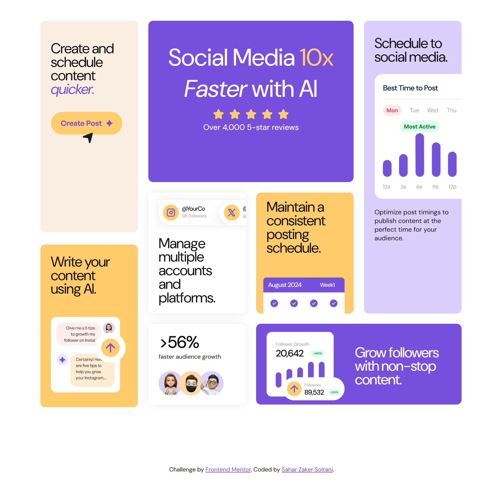

# Bento Grid Main

 

Welcome to the **Bento Grid** project! This is a responsive web design challenge from [Frontend Mentor](https://www.frontendmentor.io). The goal of this project is to create a visually appealing and fully responsive bento-style grid layout using modern web technologies.

## Overview

This project is a solution to the **Bento Grid** challenge from Frontend Mentor. The design focuses on creating a responsive grid layout that adapts seamlessly to different screen sizes, from mobile devices to desktops. The layout is inspired by the popular "bento box" design trend, which organizes content into modular, grid-based sections.

## Features

- **Responsive Design**: The layout is fully responsive and adapts to various screen sizes.
- **Modern Grid Layout**: Utilizes CSS Grid to create a visually appealing bento-style grid.
- **Interactive Elements**: Includes hover effects and animations for a dynamic user experience.
- **Accessibility**: Built with accessibility in mind, ensuring a great experience for all users.

## Technologies Used

- **HTML5**: Semantic markup for better structure and accessibility.
- **CSS3**: Flexbox, Grid, and custom properties for styling.
- **JavaScript**: Optional interactivity (if applicable).
- **Git & GitHub**: Version control and project hosting.

## Live Project

You can view the live version of this project here:  
[Bento Grid Live Demo](https://saharzakersoltani.github.io/bento-grid-main/)

## Frontend Mentor Challenge

This project is a solution to the following Frontend Mentor challenge:  
[Frontend Mentor Bento Grid Challenge](https://www.frontendmentor.io/challenges/bento-grid-RMydElrlOj)

### What I Learned

- **Responsive Design**: I reinforced my understanding of creating responsive layouts using CSS Grid and Flexbox.
- **CSS Custom Properties**: I utilized CSS variables to maintain consistent styling across the project.
- **Accessibility**: I ensured the page is accessible by using semantic HTML and proper ARIA attributes.

## Acknowledgments

- **Frontend Mentor**: For providing the design challenge and assets.
- **Community**: Thanks to the open-source community for providing resources and inspiration.

## Contact

If you have any questions or feedback, feel free to reach out:

- **Sahar Zaker Soltani**
- **GitHub**: [saharzakersoltani](https://github.com/saharzakersoltani)
- **Email**: [sahar.zs2002@gmail.com]

